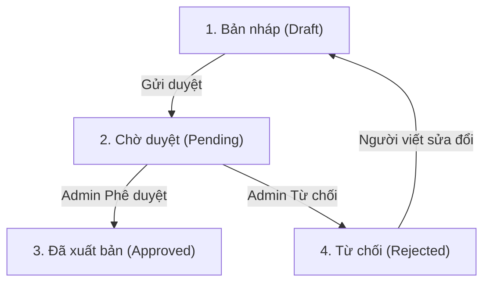

# Kế hoạch triển khai Phân hệ Quản trị & Phê duyệt Bài viết (Admin Dashboard & Approval Flow)

Tài liệu này mô tả chi tiết thiết kế kỹ thuật, luồng dữ liệu, giao diện người dùng và quy trình kiểm duyệt bài viết cho trang web Công ty Cổ phần Xi măng Cẩm Phả.

---

## 1. ⚙️ Kiến trúc & Cơ chế Lưu trữ Dữ liệu (State Management & Storage)

Do website hiện tại được triển khai tĩnh (Static/Serverless) trên Vercel, chúng ta sẽ xây dựng giải pháp **Stateful Client-side** sử dụng `localStorage` để đồng bộ dữ liệu giữa trang quản trị (Admin) và trang người dùng (Public) mà không cần cấu hình database vật lý phức tạp.

* **Dữ liệu mặc định (Seed Data)**:
  * Khi khởi chạy lần đầu, ứng dụng kiểm tra xem `localStorage` đã tồn tại dữ liệu bài viết chưa.
  * Nếu chưa, ứng dụng tự động sao chép toàn bộ dữ liệu tĩnh từ các file cấu hình hiện tại:
    * `NOTIFICATIONS_DATA` (từ `src/data/notifications.ts`)
    * `NEWS_DATA` (từ `src/data/news.ts`)
    * `PRODUCTS_DATA` (từ `src/data/products.ts`)
    * `PROJECTS_DATA` (từ `src/data/projects.ts`)
    vào các key tương ứng trong `localStorage` (ví dụ: `campha_news`, `campha_notifications`).
* **Đồng bộ Public Pages**:
  * Chỉnh sửa các trang danh sách và chi tiết công cộng (Tin tức, Thông báo, Sản phẩm, Dự án) để ưu tiên đọc dữ liệu từ `localStorage` nếu có, ngược lại fallback về dữ liệu tĩnh mặc định. Việc này giúp mọi thay đổi duyệt/thêm/sửa/xóa từ trang Admin lập tức có hiệu lực ở trang ngoài.

---

## 2. 🔐 Màn hình Đăng nhập Quản trị (`/admin/login`)

Để bảo vệ khu vực quản trị, chúng ta thiết lập màn hình đăng nhập bảo mật giả lập:
* **Giao diện**:
  * Thiết kế Glassmorphic card cao cấp trên nền mờ tối sang trọng.
  * Các trường thông tin: Email (`admin@camphacement.vn`) và Mật khẩu.
* **Xác thực**:
  * Kiểm tra tài khoản tại Client. Nếu hợp lệ, sinh một token giả lập (ví dụ: `token_campha_admin_2026`) lưu vào `localStorage` cùng thời điểm hết hạn (24 giờ).
  * Route Guard: Mọi trang con thuộc `/admin/*` (ngoại trừ `/admin/login`) nếu không tìm thấy token hợp lệ sẽ tự động redirect về trang đăng nhập.

---

## 3. ✍️ Quy chuẩn Trình soạn thảo (Article Drafting Specification)

Trình soạn thảo được tích hợp dưới dạng Modal hoặc Slide-over với đầy đủ công cụ để admin soạn bài nhanh chóng:

### A. Các trường dữ liệu chính
1. **Tiêu đề (Title)**: Nhập chuỗi văn bản (tối đa 150 ký tự).
2. **Tóm tắt (Description)**: Đoạn giới thiệu ngắn gọn hiển thị ở thẻ danh sách (150-250 ký tự).
3. **Nội dung bài viết (Content - Rich Text)**:
   * Cung cấp một khung soạn thảo văn bản trực quan (WYSIWYG) hỗ trợ định dạng: Bold, Italic, Underline, Bullet/Numbered List, canh lề, chèn liên kết.
   * Chế độ **HTML Source Code View**: Cho phép chèn trực tiếp các thẻ HTML thô để cấu hình nâng cao như căn chỉnh khoảng cách padding/margin của ảnh, định dạng màu văn bản theo nhận diện thương hiệu Viettel (ví dụ sử dụng Tailwind class: `text-viettel-red font-bold`).
4. **Ảnh đại diện (Thumbnail Image)**:
   * Hộp chọn ảnh cục bộ.
   * **Cơ chế tải lên giả lập**: Ảnh chọn từ máy tính sẽ được chuyển đổi sang chuỗi dữ liệu **Base64 DataURL** hoặc link ảnh tạm thời (`URL.createObjectURL(file)`) và lưu trữ trực tiếp vào LocalStorage để bài đăng có ảnh hiển thị ngay lập tức.
5. **Tệp tài liệu PDF đính kèm**:
   * Chỉ kích hoạt cho loại bài viết "Thông báo".
   * Cho phép chọn tệp PDF từ máy tính.
   * Tự động tính toán dung lượng tệp tin (ví dụ: `1.2 MB`, `450 KB`) hiển thị lên UI.
   * Tích hợp xem trước trực tiếp tài liệu PDF (PDF Preview) thông qua component `PDFFlipbook` ngay trên giao diện soạn thảo để admin kiểm tra tài liệu trước khi gửi phê duyệt.

---

## 🎛️ 4. Kiểm soát Vị trí & Kiểu hiển thị (Placement & Style Controls)

Admin được cung cấp các trường chọn cấu hình trực quan để quyết định bài viết sẽ hiển thị ở đâu và như thế nào:

### A. Vị trí hiển thị (Display Target)
* **Ghim nổi bật Trang chủ (`featured` - Checkbox)**: Đưa bài viết lên trang chủ ở phần Slide Banner tiêu điểm hoặc khu vực Tin nổi bật hàng đầu.
* **Ghim đầu chuyên mục (`featuredInCategory` - Checkbox)**: Đảm bảo bài viết luôn nằm ở vị trí đầu tiên của danh sách chuyên mục tương ứng để tăng lượt tiếp cận.
* **Chuyên mục phân loại (`category` - Dropdown)**:
  * Với tin tức: *Tin công ty*, *Phỏng vấn*, *Tuyển dụng*.
  * Với thông báo: *Tài chính*, *Cổ đông*, *Nội bộ*, *Thông báo chung*.

### B. Kiểu hiển thị (Display Style - Dropdown Select)
Admin có thể tùy chỉnh chính xác thẻ hiển thị của bài viết ngoài trang danh sách công cộng:
1. **`standard` (Thẻ tiêu chuẩn)**: Bố cục lưới dọc truyền thống, ảnh thumbnail ở trên, chữ ở dưới. Thích hợp cho tin tức hàng ngày.
2. **`split` (Thẻ chia đôi ngang)**: Bố cục ngang tỉ lệ 50:50, ảnh nằm trái, chữ nằm phải (hoặc ngược lại). Giúp phá vỡ sự đơn điệu của danh sách dạng lưới.
3. **`bento` (Lưới Bento Grid lớn)**: Thẻ chiếm diện tích lớn gấp đôi trong lưới (2 cột hoặc 2 hàng), sử dụng hình ảnh nền tràn viền kèm hiệu ứng bóng đổ sâu và text nổi bật. Cực kỳ thích hợp cho các bài viết sự kiện lớn, công trình lớn.
4. **`minimal` (Chỉ hiển thị Text)**: Định dạng danh sách rút gọn không kèm ảnh, chỉ có tiêu đề, ngày đăng và nút Xem chi tiết. Tối ưu cho danh mục đấu thầu, báo giá cần hiển thị nhiều thông tin cùng lúc.

---

## 🔄 5. Quy trình Kiểm duyệt bài viết (Approval Workflow Lifecycle)

Trạng thái bài viết (`status`) sẽ điều khiển quyền hiển thị nội dung trên website qua 4 bước:



* **Bước 1: Soạn thảo & Bản nháp (Draft)**:
  * Bài viết mới tạo mặc định ở trạng thái `draft`. Chỉ hiển thị trong phần quản lý bài viết nháp của người dùng trên trang Admin, không hiển thị ra ngoài website.
* **Bước 2: Gửi phê duyệt (Pending)**:
  * Người viết bấm "Gửi duyệt", bài viết chuyển trạng thái sang `pending`. Bài viết xuất hiện trong danh sách hàng đợi kiểm duyệt của Admin. Dashboard của Admin sẽ hiển thị huy hiệu thông báo màu vàng nhấp nháy cho biết có bài viết cần xem xét.
* **Bước 3: Thực hiện kiểm duyệt (Reviewing)**:
  * Admin chọn bài đăng chờ duyệt. Giao diện mở bảng **Xem trước giao diện thực tế (Live Preview Mockup)** mô phỏng đúng giao diện người dùng sẽ thấy ngoài trang chủ.
  * **Nút Phê duyệt (Approve)**: Admin bấm duyệt bài, bài viết lập tức chuyển trạng thái sang `approved`, xuất bản công khai ra ngoài trang chủ với kiểu hiển thị và vị trí đã cấu hình.
  * **Nút Từ chối (Reject)**: Admin bấm từ chối, một popup mở ra yêu cầu Admin nhập **Lý do từ chối (Rejection Reason)** (ví dụ: *"Thông tin giá trị chưa chính xác", "Cần bổ sung file PDF đóng dấu đỏ"*).
* **Bước 4: Xử lý bài bị từ chối**:
  * Bài viết chuyển sang trạng thái `rejected`. Bài viết được đưa lại mục quản lý cá nhân của người viết kèm theo lý do từ chối để người viết chỉnh sửa, hoàn thiện và gửi duyệt lại.

---

## 6. Giao diện Người dùng Phân hệ Admin (`/admin`)

* **Sidebar (Thanh điều hướng)**:
  * Chứa Logo Cẩm Phả Cement màu trắng trên nền tối.
  * Các tab chính:
    * **Tổng quan (Dashboard)**: Biểu đồ SVG thống kê lượng bài viết, số bài đã xuất bản, số bài chờ duyệt, các hoạt động kiểm duyệt gần đây.
    * **Hàng đợi kiểm duyệt (Approval Queue)**: Nơi chứa các bài viết `pending`, hiển thị nổi bật dạng danh sách kèm nút "Review" để mở live preview và duyệt nhanh.
    * **Quản lý nội dung (CMS Editor)**: Danh sách bộ lọc Tab (Tin tức, Thông báo, Sản phẩm, Dự án) có đầy đủ chức năng Tìm kiếm, thêm mới bài đăng, chỉnh sửa bài đăng và Xóa bài đăng.
    * **Đăng xuất (Logout)**.
* **Bảng điều khiển tổng quan**:
  * Các ô thống kê nhanh số liệu (Total, Approved, Pending, Rejected).
  * Biểu đồ đường vẽ (Line Chart) biểu thị số lượng bài đăng được duyệt qua từng tháng trong năm 2026.

---

## 7. Kế hoạch xác thực & Đảm bảo Chất lượng (Verification Plan)

### Kiểm tra tự động (Automated Verification)
* Chạy kiểm tra kiểu TypeScript để đảm bảo tính an toàn dữ liệu:
  ```bash
  npx tsc --noEmit
  ```
* Chạy linter để kiểm tra chất lượng mã nguồn:
  ```bash
  npm run lint
  ```
* Chạy bộ checklist toàn diện dự án để đảm bảo các tiêu chí Security, Lint, UX, SEO đều đạt chuẩn:
  ```bash
  $env:PYTHONIOENCODING="utf-8"; python .agent/scripts/checklist.py .
  ```

### Kiểm tra thủ công (Manual Verification)
1. Thử truy cập `/admin` khi chưa đăng nhập, xác nhận bị chặn chuyển hướng về `/admin/login`.
2. Đăng nhập với tài khoản `admin@camphacement.vn`.
3. Tạo một thông báo mới ở trạng thái `draft`. Xác nhận thông báo chưa xuất hiện trên trang danh sách thông báo.
4. Bấm "Gửi duyệt" thông báo. Dashboard admin nhận được cảnh báo hàng đợi có bài viết mới.
5. Mở xem chi tiết bài đăng chờ duyệt, xác nhận khung Preview mô phỏng chính xác giao diện hiển thị.
6. Bấm "Từ chối" kèm lý do "Cần định dạng lại tiêu đề". Xác nhận bài viết chuyển sang trạng thái Rejected và ghi nhận đúng lý do.
7. Sửa lại bài viết và bấm "Phê duyệt". Kiểm tra ngoài trang danh sách thông báo công cộng để xác nhận bài viết xuất hiện đúng vị trí và kiểu hiển thị đã cấu hình.

---

## 🗄️ 8. Thiết kế Cơ sở Dữ liệu (Database Design)

Để hỗ trợ lưu trữ lâu dài và phân tích dữ liệu chuyên nghiệp sau khi hệ thống tích hợp với Backend thật (ví dụ: FastAPI server), thiết kế cơ sở dữ liệu quan hệ (SQL Schema) chi tiết đã được tạo tại:
* [plan/PLAN-database-design.md](file:///g:/Source-code/website/plan/PLAN-database-design.md)

Tài liệu thiết kế bao gồm:
* Sơ đồ thực thể quan hệ (ERD) chi tiết.
* Mã nguồn SQL tạo bảng (DDL Schema) cho `users`, `posts`, `products`, `projects` và `approval_logs`.
* Chiến lược đánh chỉ mục (Index) và tối ưu hóa hiệu suất truy vấn.
