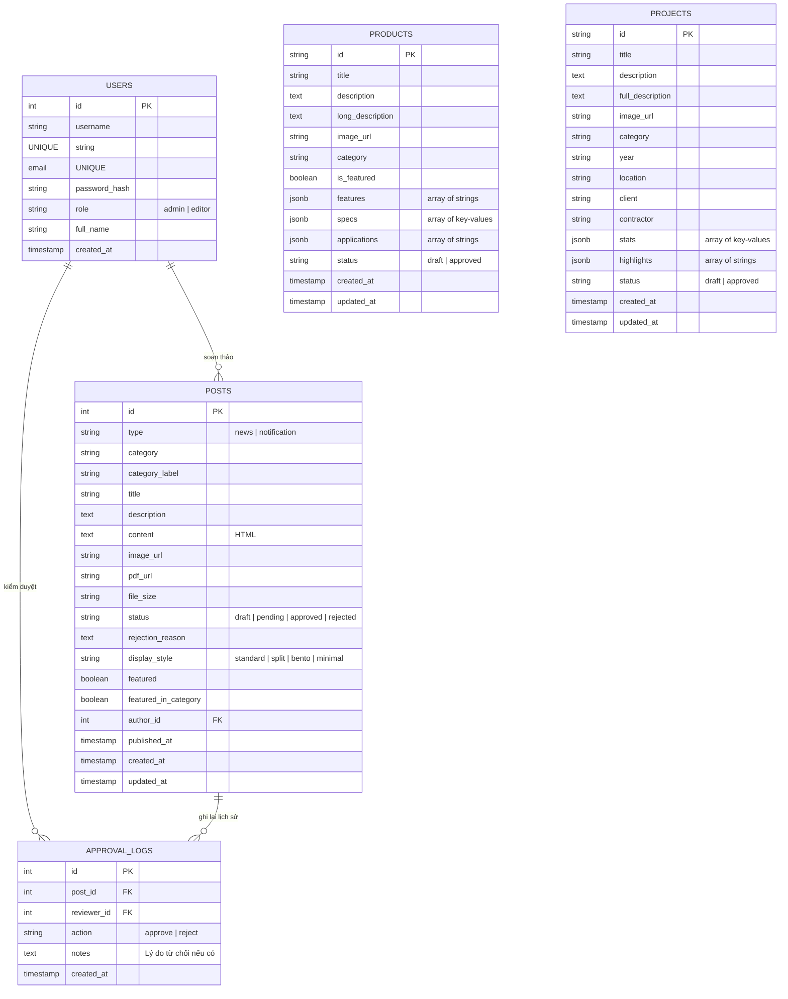

# Thiết kế Cơ sở Dữ liệu Phân hệ Quản trị (Database Schema Design)

Tài liệu này đề xuất thiết kế cơ sở dữ liệu quan hệ (SQL) chuẩn hóa phục vụ lưu trữ thông tin bài viết, sản phẩm, dự án và lịch sử kiểm duyệt cho hệ thống website Xi măng Cẩm Phả.

Thiết kế này tương thích hoàn toàn với các cơ sở dữ liệu như **PostgreSQL** (khuyến nghị cho môi trường sản xuất) hoặc **SQLite** (cho môi trường thử nghiệm).

---

## 📊 1. Sơ đồ Quan hệ Thực thể (Entity Relationship Diagram)



---

## 💾 2. Định nghĩa chi tiết các bảng (SQL DDL Schema)

### Bảng: `users` (Quản trị viên & Biên tập viên)
Bảng lưu trữ thông tin tài khoản người dùng có quyền truy cập trang quản trị.
```sql
CREATE TABLE users (
    id SERIAL PRIMARY KEY,
    username VARCHAR(50) UNIQUE NOT NULL,
    email VARCHAR(100) UNIQUE NOT NULL,
    password_hash VARCHAR(255) NOT NULL,
    role VARCHAR(20) NOT NULL CHECK (role IN ('admin', 'editor')),
    full_name VARCHAR(100),
    created_at TIMESTAMP DEFAULT CURRENT_TIMESTAMP
);
```

### Bảng: `posts` (Quản lý Bài viết & Thông báo)
Dùng chung một bảng chuẩn hóa cho cả Tin tức và Thông báo giúp dễ dàng tối ưu hóa truy vấn và mở rộng tính năng.
```sql
CREATE TABLE posts (
    id SERIAL PRIMARY KEY,
    type VARCHAR(20) NOT NULL CHECK (type IN ('news', 'notification')),
    category VARCHAR(50) NOT NULL,
    category_label VARCHAR(100) NOT NULL,
    title VARCHAR(255) NOT NULL,
    description TEXT,
    content TEXT NOT NULL, -- Định dạng HTML từ trình soạn thảo
    image_url VARCHAR(255),
    pdf_url VARCHAR(255), -- Chỉ dùng cho thông báo
    file_size VARCHAR(50), -- Chỉ dùng cho thông báo
    status VARCHAR(20) DEFAULT 'draft' CHECK (status IN ('draft', 'pending', 'approved', 'rejected')),
    rejection_reason TEXT,
    display_style VARCHAR(20) DEFAULT 'standard' CHECK (display_style IN ('standard', 'split', 'bento', 'minimal')),
    featured BOOLEAN DEFAULT FALSE,
    featured_in_category BOOLEAN DEFAULT FALSE,
    author_id INT REFERENCES users(id) ON DELETE SET NULL,
    published_at TIMESTAMP,
    created_at TIMESTAMP DEFAULT CURRENT_TIMESTAMP,
    updated_at TIMESTAMP DEFAULT CURRENT_TIMESTAMP
);
```

### Bảng: `products` (Sản phẩm)
Bảng lưu thông số kỹ thuật của các loại xi măng, clinker.
```sql
CREATE TABLE products (
    id VARCHAR(50) PRIMARY KEY,
    title VARCHAR(100) NOT NULL,
    description TEXT NOT NULL,
    long_description TEXT NOT NULL,
    image_url VARCHAR(255) NOT NULL,
    category VARCHAR(50) NOT NULL,
    is_featured BOOLEAN DEFAULT FALSE,
    features JSONB, -- Lưu mảng chuỗi đặc điểm nổi bật
    specs JSONB, -- Lưu mảng đối tượng thông số [{ "label": "...", "value": "..." }]
    applications JSONB, -- Lưu mảng ứng dụng
    status VARCHAR(20) DEFAULT 'draft' CHECK (status IN ('draft', 'approved')),
    created_at TIMESTAMP DEFAULT CURRENT_TIMESTAMP,
    updated_at TIMESTAMP DEFAULT CURRENT_TIMESTAMP
);
```

### Bảng: `projects` (Dự án công trình tiêu biểu)
Lưu trữ thông tin các dự án công trình sử dụng xi măng Cẩm Phả.
```sql
CREATE TABLE projects (
    id VARCHAR(50) PRIMARY KEY,
    title VARCHAR(100) NOT NULL,
    description TEXT NOT NULL,
    full_description TEXT,
    image_url VARCHAR(255) NOT NULL,
    category VARCHAR(50) NOT NULL,
    year VARCHAR(10) NOT NULL,
    location VARCHAR(255),
    client VARCHAR(255),
    contractor VARCHAR(255),
    stats JSONB, -- Lưu mảng thông số [{ "label": "...", "value": "..." }]
    highlights JSONB, -- Lưu mảng điểm nổi bật
    status VARCHAR(20) DEFAULT 'draft' CHECK (status IN ('draft', 'approved')),
    created_at TIMESTAMP DEFAULT CURRENT_TIMESTAMP,
    updated_at TIMESTAMP DEFAULT CURRENT_TIMESTAMP
);
```

### Bảng: `approval_logs` (Nhật ký Phê duyệt & Kiểm duyệt)
Bảng dùng để ghi lại lịch sử kiểm duyệt của hệ thống (audit trail) phục vụ việc giám sát nội dung.
```sql
CREATE TABLE approval_logs (
    id SERIAL PRIMARY KEY,
    post_id INT REFERENCES posts(id) ON DELETE CASCADE,
    reviewer_id INT REFERENCES users(id) ON DELETE SET NULL,
    action VARCHAR(20) NOT NULL CHECK (action IN ('approve', 'reject')),
    notes TEXT, -- Ghi chú lý do từ chối
    created_at TIMESTAMP DEFAULT CURRENT_TIMESTAMP
);
```

---

## ⚡ 3. Chiến lược Đánh chỉ mục & Tối ưu hóa (Indexing Strategy)

Để đảm bảo các truy vấn ngoài trang chủ và trang danh sách chạy dưới **10ms** trên PostgreSQL, chúng ta sẽ thiết lập các Index sau:

1. **Composite Index phục vụ trang chủ & trang danh sách lọc**:
   Mục đích: Tăng tốc lọc theo phân loại và trạng thái đã duyệt, sắp xếp theo thời gian xuất bản mới nhất.
   ```sql
   CREATE INDEX idx_posts_type_status_published 
   ON posts(type, status, published_at DESC);
   ```

2. **Index Tìm kiếm văn bản (Full-Text Search)**:
   Mục đích: Tăng tốc chức năng tìm kiếm bài viết theo từ khóa trên Tiêu đề và Mô tả mà không cần quét toàn bộ bảng (Table Scan).
   Trong PostgreSQL, sử dụng `gin` index cho tối ưu tìm kiếm:
   ```sql
   CREATE INDEX idx_posts_search_vector 
   ON posts USING gin(to_tsvector('vietnamese', title || ' ' || COALESCE(description, '')));
   ```

3. **Index phục vụ sản phẩm & dự án**:
   ```sql
   CREATE INDEX idx_products_featured ON products(category, is_featured);
   CREATE INDEX idx_projects_category_year ON projects(category, year DESC);
   ```

4. **Foreign Key Index**:
   PostgreSQL không tự động tạo index trên khóa ngoại. Chúng ta tạo thêm index để tối ưu hóa phép nối (JOIN) khi lấy thông tin người viết và lịch sử kiểm duyệt:
   ```sql
   CREATE INDEX idx_posts_author ON posts(author_id);
   CREATE INDEX idx_logs_post ON approval_logs(post_id);
   ```
